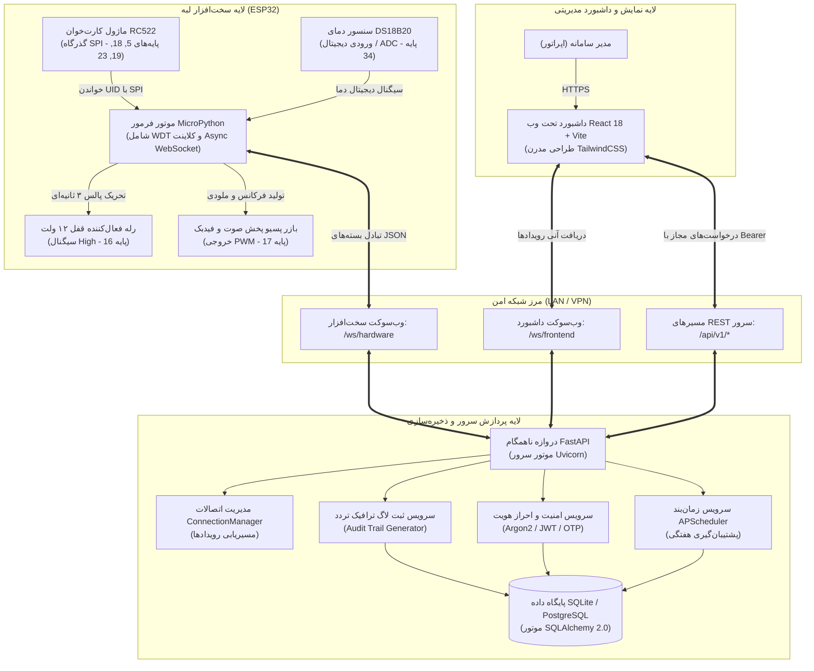
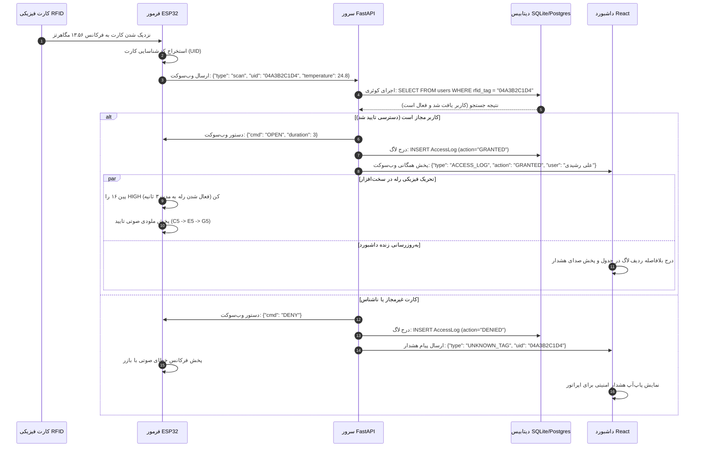

<div align="center" dir="rtl">


# سیستم کنترل تردد (Access Control System)

### سیستم کنترل تردد و تله‌متری محیطی با ESP32 و FastAPI

[](https://github.com/Ali-Rashidi-80/Simple-access-control/actions/workflows/ci.yml)
[](https://www.python.org/)
[](https://fastapi.tiangolo.com)
[](https://micropython.org/)
[](https://github.com/astral-sh/ruff)
[](http://mypy-lang.org/)
[](LICENSE)

**[English](README.md)** • **[فارسی](README.fa.md)** • **[مستندات فنی](docs/)** • **[گزارش باگ و اشکالات](https://github.com/Ali-Rashidi-80/Simple-access-control/issues)**

</div>

---

<div dir="rtl">

## 📌 معرفی سیستم

<bdi>**SentryGate**</bdi> یک سیستم کنترل تردد و تله‌متری محیطی است که برد <bdi>**ESP32**</bdi> را از طریق ارتباط دوطرفه <bdi>**WebSocket**</bdi> به سرور ناهمگام <bdi>**FastAPI**</bdi> و داشبورد مدیریتی <bdi>**React**</bdi> متصل می‌کند.

این سیستم قرائت کارت‌های فیزیکی (<bdi>**Mifare RFID**</bdi>) را با پایش دمای محیط (<bdi>**DS18B20**</bdi>)، ورود با پیامک یکبارمصرف (<bdi>**SMS OTP**</bdi>)، پشتیبان‌گیری خودکار دیتابیس با <bdi>**APScheduler**</bdi> و پایداری سخت‌افزاری (تایمر نگهبان <bdi>**WDT**</bdi> و دیود هرزگرد <bdi>**Flyback**</bdi>) یکپارچه کرده است.

---

## 📑 فهرست مطالب

- [قابلیت‌های کلیدی و معماری](#-قابلیت‌های-کلیدی-و-معماری)
- [معماری سیستم و جریان تبادل داده](#-معماری-سیستم-و-جریان-تبادل-داده)
- [مشخصات سخت‌افزار و نقشه سیم‌بندی](#-مشخصات-سخت‌افزار-و-نقشه-سیم‌بندی)
- [مشخصات پروتکل‌ها و چارچوب پیام‌ها](#-مشخصات-پروتکل‌ها-و-چارچوب-پیام‌ها)
- [ساختار فایل‌های مخزن](#-ساختار-فایل‌های-مخزن)
- [راهنمای راه‌اندازی سریع](#-راهنمای-راه‌اندازی-سریع)
  - [راه‌اندازی مبتنی بر داکر (پیشنهادی)](#۱-راه‌اندازی-مبتنی-بر-داکر-پیشنهادی)
  - [راه‌اندازی بومی برای توسعه‌دهندگان](#۲-راه‌اندازی-بومی-برای-توسعه‌دهندگان)
  - [پروگرم و فلش کردن فرمور ESP32](#۳-پروگرم-و-فلش-کردن-فرمور-esp32)
- [معماری امنیت و تدابیر تاب‌آوری](#-معماری-امنیت-و-تدابیر-تاب‌آوری)
- [گیت‌های سنجش کیفیت و اعتبارسنجی خودکار](#-گیت‌های-سنجش-کیفیت-و-اعتبارسنجی-خودکار)
- [فهرست اسناد تکمیلی](#-فهرست-اسناد-تکمیلی)
- [مشارکت و مجوز استفاده](#-مشارکت-و-مجوز-استفاده)

---

## 🚀 قابلیت‌های کلیدی و معماری

| قابلیت کلیدی | پیاده‌سازی مهندسی | توضیحات فنی |
| :--- | :--- | :--- |
| **پایداری سخت‌افزار** | میکروپایتون با تایمر نگهبان سخت‌افزاری ۱۵ ثانیه‌ای (<bdi>**WDT**</bdi>) | بازیابی خودکار در صورت توقف حلقه شبکه در کمتر از ۲ ثانیه |
| **ارتباط بلادرنگ دوطرفه** | کانال‌های مجزای وب‌سوکت (<bdi>**/ws/hardware**</bdi> و <bdi>**/ws/frontend**</bdi>) | تاخیر کمتر از ۱۵ میلی‌ثانیه در پاسخ و حذف سربار ناشی از <bdi>Polling</bdi> |
| **تله‌متری محیطی** | ارتباط دیجیتال ۱ سیمه با سنسور <bdi>**DS18B20**</bdi> و بررسی <bdi>**CRC**</bdi> | تشخیص حرارت بیش از حد در جعبه تجهیزات یا محیط ورودی |
| **امنیت دیتابیس** | استفاده از <bdi>**SQLAlchemy 2.0 Async**</bdi> با مقیدسازی پارامتری کوئری‌ها | ایمنی در برابر تزریق <bdi>SQL</bdi> به دلیل عدم استفاده از کوئری‌های خام رشته‌ای |
| **مدیریت هویت و سطوح دسترسی** | هش <bdi>**Argon2/bcrypt**</bdi>، توکن امضاشده <bdi>**JWT**</bdi> و تایید پیامکی <bdi>**OTP**</bdi> | تفکیک نقش‌های کاربری، کنترل دسترسی و ثبت تاریخچه ترددها |
| **نگهداری خودکار سیستم** | تسک‌های زمان‌بندی‌شده <bdi>**APScheduler**</bdi> در بک‌اند | تهیه نسخه پشتیبان هفتگی از دیتابیس و پاکسازی لاگ‌های قدیمی |

---

## 🏗️ معماری سیستم و جریان تبادل داده

این سیستم برای پایداری و تفکیک وظایف، فرآیندهای دریافت سیگنال فیزیکی، اعتبارسنجی قوانین و رابط کاربری را در سه لایه مستقل تفکیک کرده است:



### نمودار توالی رویدادها: از اسکن کارت تا تحریک قفل الکتریکی



---

## 🔌 مشخصات سخت‌افزار و نقشه سیم‌بندی

### فهرست قطعات مورد نیاز (<bdi>BOM</bdi>)

| قطعه | مشخصات فنی | تعداد | نقش در مدار |
| :--- | :--- | :---: | :--- |
| **ESP32 NodeMCU** | مدل <bdi>ESP-WROOM-32</bdi> (دو هسته ۲۴۰ مگاهرتز، ۴ مگابایت فلش، وای‌فای) | ۱ | کنترلر اصلی لبه |
| **RC522 RFID Module** | فرکانس ۱۳.۵۶ مگاهرتز، پشتیبانی از کارت‌های <bdi>Mifare Classic 1K</bdi> | ۱ | ماژول کارت‌خوان بدون تماس |
| **ماژول رله ایزوله** | رله تک کانال ۵ یا ۳.۳ ولت با اپتوکوپلر ایزولاسیون | ۱ | قطع و وصل برق ۱۲ ولت قفل |
| **بازر پسیو** | پیزوالکتریک ۳.۳ تا ۵ ولت (<bdi>Passive Buzzer</bdi>) | ۱ | خروجی صوتی هشدار و پخش ملودی |
| **سنسور دمای DS18B20** | سنسور دیجیتال با دقت اندازه‌گیری بالا | ۱ | پایش حرارت محیط و باکس تجهیزات |
| **دیود هرزگرد** | دیود سیلیکونی <bdi>1N4007</bdi> (تحمل ۱۰۰۰ ولت، ۱ آمپر) | ۱ | حذف ولتاژ بازگشتی سلفی قفل برقی |
| **منبع تغذیه** | آداپتور ۱۲ ولت ۲ آمپر صنعتی + ماژول کاهنده باک (<bdi>Buck Converter 5V</bdi>) | ۱ | تفکیک تغذیه رله از پردازنده |

### ماتریس تخصیص پین‌های سخت‌افزار (<bdi>Pinout</bdi>)

```
                      +-------------------+
                      |   ESP32 DevKit    |
                      |                   |
      RC522 SDA/SS <--| GPIO 05   GPIO 16 |---> فرمان رله قفل (IN)
      RC522 SCK    <--| GPIO 18   GPIO 17 |---> خروجی بازر پسیو (PWM)
      RC522 MISO   <--| GPIO 19   GPIO 04 |---> پین ریست RC522 (RST)
      RC522 MOSI   <--| GPIO 23   GPIO 34 |---> ورودی سنسور دما (ADC/1-Wire)
      زمین مشترک   <--| GND       3V3     |---> تغذیه RC522 (فقط ۳.۳ ولت!)
                      +-------------------+
```

> [!CAUTION]
> **هشدار جدی اضافه ولتاژ:** پین تغذیه ماژول <bdi>**RC522**</bdi> باید حتماً به خروجی **۳.۳ ولت** متصل گردد. اتصال اشتباهی آن به خط ۵ ولت به سوختن قطعی تراشه منجر خواهد شد.
> 
> **ضرورت نصب دیود هرزگرد:** حتماً یک دیود <bdi>**1N4007**</bdi> را به صورت بایاس معکوس در موازات دو سر بوبین قفل برقی نصب کنید. انرژی مغناطیسی تخلیه‌شده از سیم‌پیچ قفل می‌تواند پیک‌های ولتاژی بالای ۲۰۰ ولت تولید کند که باعث ریست مکرر <bdi>**ESP32**</bdi> یا تخریب حافظه فلش می‌شود.

---

## 📡 مشخصات پروتکل‌ها و چارچوب پیام‌ها

### ۱. رویدادهای ارسالی از سخت‌افزار به سرور (<bdi>**/ws/hardware**</bdi>)

```json
// رویداد اسکن کارت فیزیکی
{
  "type": "scan",
  "uid": "04A3B2C1D4",
  "temperature": 26.4,
  "is_duress": false
}

// ارسال داده‌های تله‌متری محیطی
{
  "type": "telemetry",
  "temperature": 27.1,
  "humidity": 45.0
}

// ضربان سلامت ارتباط (Heartbeat)
{
  "type": "ping"
}
```

### ۲. فرامین کنترلی سرور به سخت‌افزار

```json
// فرمان صدور مجوز و فعال‌سازی رله
{
  "cmd": "OPEN",
  "duration": 3
}

// فرمان رد دسترسی
{
  "cmd": "DENY",
  "duration": 0
}

// تاییدیه ضربان سلامت
{
  "cmd": "PONG"
}
```

### ۳. مسیرهای کلیدی رابط برنامه‌نویسی (<bdi>**REST API**</bdi>)

| متد | مسیر سرویس | مجوز دسترسی | شرح عملکرد |
| :--- | :--- | :--- | :--- |
| `POST` | `/auth/login` | عمومی | احراز هویت مدیر با نام کاربری و رمزعبور و صدور توکن <bdi>JWT</bdi> |
| `POST` | `/auth/otp/send` | عمومی | تولید و ارسال کد یکبارمصرف ۶ رقمی پیامکی از درگاه ملی‌پیامک |
| `POST` | `/auth/otp/verify` | عمومی | راستی‌آزمایی کد پیامکی و فعال‌سازی نشست کاربری |
| `GET` | `/users/` | با توکن معتبر | دریافت فهرست صفحه‌بندی‌شده کاربران و کارت‌های اختصاص‌یافته |
| `POST` | `/users/` | با توکن معتبر | تعریف کاربر جدید و تخصیص کد فیزیکی <bdi>RFID</bdi> به وی |
| `GET` | `/logs/` | با توکن معتبر | گزارش‌گیری از تاریخچه ترددها با فیلتر بازه زمانی و وضعیت ورود |
| `GET` | `/settings/` | با توکن معتبر | مشاهده و تنظیم پارامترهای کنترلر و زمان‌بندی پشتیبان‌گیری |

---

## 📂 ساختار فایل‌های مخزن

```
Access-Control-System/
├── .github/
│   └── workflows/
│       └── ci.yml               # خط لوله اتوماسیون CI گیت‌هاب (پایتون 3.11 و 3.12)
├── backend/
│   ├── app/
│   │   ├── routers/             # مسیرهای پردازش REST (کاربران، لاگ‌ها)
│   │   ├── services/            # منطق پردازش اصلی (موتور وب‌سوکت، امنیت، پیامک)
│   │   ├── database.py          # تنظیمات موتور ناهمگام دیتابیس با SQLAlchemy
│   │   ├── models.py            # مدل‌های نگاشت رابطه‌ای دیتابیس (User, AccessLog, Setting)
│   │   ├── schemas.py           # اعتبارسنجی دقیق قراردادهای ورودی با Pydantic v2
│   │   └── main.py              # نقطه ورود اصلی اپلیکیشن و وب‌سوکت هاب
│   ├── tests/                   # مجموعه ۱۱۲ تست خودکار واحد و یکپارچگی
│   │   ├── conftest.py          # فیکسچرهای تست و جداسازی دیتابیس ایزوله
│   │   ├── test_api.py          # تست جامع مسیرهای REST
│   │   ├── test_database.py     # تست تراکنش‌ها و لایه پایداری داده
│   │   ├── test_esp32_simulation.py # شبیه‌سازی پروتکل‌های سخت‌افزار ESP32
│   │   ├── test_integration.py  # تست سناریوهای کامل ورود تا خروج
│   │   ├── test_otp.py          # اعتبارسنجی چالش و تایید کد پیامکی
│   │   ├── test_security.py     # آزمون امنیت هش رمزعبور و توکن‌ها
│   │   └── test_websocket.py    # تست عملکرد همروندی و تاخیر کانال‌های وب‌سوکت
│   ├── Dockerfile               # ایمیج بهینه‌سازی‌شده برای محیط عملیاتی
│   └── requirements.txt         # وابستگی‌های تثبیت‌شده پایتون
├── frontend/                    # داشبورد مدیریتی پیاده‌سازی‌شده با React 18 و Vite
├── micro-python-esp32/
│   ├── boot.py                  # مقداردهی اولیه سخت‌افزار و شبکه در بوت ESP32
│   ├── main.py                  # حلقه اصلی لبه (کارت‌خوان RC522، تایمر WDT، کلاینت سوکت)
│   ├── mfrc522.py               # درایور بهینه‌سازی‌شده ارتباط SPI با کارت‌خوان
│   ├── config.example.json      # قالب تنظیمات وای‌فای و آدرس سرور
│   └── test/                    # اسکریپت‌های تست کارگاهی لبه
├── docs/
│   ├── assets/                  # فایل‌های لوگوی سه‌بعدی و بنر سیستم
│   ├── ARCHITECTURE.md          # سند معماری عمیق و نمودارهای تحلیلی
│   ├── HARDWARE_GUIDE.md        # نقشه لحیم‌کاری، مونتاژ قطعات و نکات نویزگیری
│   └── CONTRIBUTING.md          # استاندارد کدنویسی، فرمت‌بندی و شرایط پول‌ریکوئست
├── docker-compose.yml           # پیکربندی ارکستراسیون سرویس‌ها با کانتینر
├── pyproject.toml               # تنظیمات متمرکز ruff، black، isort، mypy و pytest
├── .env.example                 # قالب امن متغیرهای محیطی بدون افشای رمزها
├── LICENSE                      # مجوز رسمی متن‌باز MIT
├── SECURITY.md                  # سیاست گزارش آسیب‌پذیری‌های امنیتی
├── README.md                    # مستند مرجع انگلیسی سیستم
└── README.fa.md                 # مستند کامل فارسی سیستم
```

---

## ⚡ راهنمای راه‌اندازی سریع

### ۱. راه‌اندازی مبتنی بر داکر (پیشنهادی)

برای استقرار پایدار در محیط تولید بدون درگیر شدن با وابستگی‌های بومی:

```bash
# ۱. کلون کردن مخزن پروژه
git clone https://github.com/Ali-Rashidi-80/Access-Control-System.git
cd Access-Control-System

# ۲. پیکربندی متغیرهای محیطی
cp .env.example .env
# متغیر SECRET_KEY و اطلاعات دسترسی را در فایل .env ویرایش کنید

# ۳. بیلد و اجرای کانتینرها در پس‌زمینه
docker compose up -d --build

# ۴. بررسی وضعیت کانتینرها
docker compose ps
```

سرویس‌ها بلافاصله در آدرس‌های زیر در دسترس خواهند بود:
- **داشبورد مدیریتی:** `<bdi>http://localhost:3000</bdi>` (یا پورت ۸۰)
- **مستندات تعاملی سرور (<bdi>OpenAPI</bdi>):** `<bdi>http://localhost:8000/docs</bdi>`
- **نقطه اتصال وب‌سوکت سخت‌افزار:** `<bdi>ws://localhost:8000/ws/hardware</bdi>`

---

### ۲. راه‌اندازی بومی برای توسعه‌دهندگان

#### راه‌اندازی بک‌اند پایتون
```bash
cd backend

# ایجاد محیط مجازی ایزوله
python -m venv .venv
source .venv/bin/activate  # در ویندوز: .venv\Scripts\activate

# نصب پکیج‌های پیش‌نیاز
pip install -r requirements.txt

# مقداردهی اولیه پایگاه داده و ساخت مدیر پیش‌فرض (admin / admin123)
python init_db.py

# اجرای سرور توسعه با بارگذاری مجدد خودکار
uvicorn app.main:app --reload --host 0.0.0.0 --port 8000
```

#### راه‌اندازی فرانت‌اند ری‌اکت
```bash
cd frontend

# نصب وابستگی‌های Node.js
npm install

# اجرای سرور توسعه Vite
npm run dev
```

---

### ۳. پروگرم و فلش کردن فرمور ESP32

۱. فرمور رسمی <bdi>**MicroPython**</bdi> ویژه تراشه <bdi>**ESP32**</bdi> را با ابزار <bdi>`esptool.py`</bdi> روی میکروکنترلر فلش نمایید.
۲. کابل میکروکنترلر را متصل نموده و فایل‌های پروژه را انتقال دهید:
   ```bash
   cd micro-python-esp32
   cp config.example.json config.json
   # مشخصات وای‌فای و نشانی IP سرور را در فایل config.json تنظیم کنید
   
   # انتقال فایل‌ها با استفاده از mpremote یا ampy:
   mpremote cp config.json :config.json
   mpremote cp mfrc522.py :mfrc522.py
   mpremote cp boot.py :boot.py
   mpremote cp main.py :main.py
   mpremote reset
   ```
۳. ترمینال سریال را باز کنید (<bdi>بادرِیت ۱۱۵۲۰۰</bdi>) تا از صحت اتصال وای‌فای و دست‌دادن موفق وب‌سوکت اطمینان حاصل فرمایید.

---

## 🛡️ معماری امنیت و تدابیر تاب‌آوری

- **اعتبارسنجی سخت‌گیرانه داده‌ها:** تمام بسته‌های ورودی وب‌سوکت پیش از رسیدن به دیتابیس توسط مدل‌های <bdi>**Pydantic v2**</bdi> ارزیابی شده و هر پیام ناقص یا ناشناخته بلافاصله رد می‌شود.
- **حالت ایمن در قطع برق (<bdi>Fail-Secure</bdi>):** اتصالات فیزیکی رله در وضعیت <bdi>**Normally Open (NO)**</bdi> سربندی شده است؛ بدین ترتیب در صورت قطع برق کل سیستم یا فریز پردازنده، قفل فیزیکی مسدود باقی می‌ماند.
- **ایزولاسیون کامل اسرار:** هیچ رمزعبور، توکن ارتباطی یا فایل دیتابیسی در تاریخچه گیت کامیت نمی‌شود و مخزن کاملاً پاکسازی شده است.
- **تایمر نگهبان و رفع بن‌بست:** تایمر سگ نگهبان سخت‌افزاری (<bdi>WDT</bdi>) در صورت عدم پاسخگویی یا بن‌بست سوکت بیش از ۱۵ ثانیه، مدار را به صورت آنی ریست سخت‌افزاری می‌کند.

---

## 🧪 گیت‌های سنجش کیفیت و اعتبارسنجی خودکار

کیفیت کدها و عملکرد اجزا به شکل قطعی و مکانیزه تست می‌شود:

```bash
# ۱. اعتبارسنجی کامپایل و سلامت بایت‌کد پایتون
python -m compileall backend

# ۲. تحلیل ایستای سریع با Ruff
python -m ruff check backend

# ۳. اعتبارسنجی فرمت کد با Black و Isort
python -m black backend --check
python -m isort backend --check-only

# ۴. بررسی سخت‌گیرانه انطباق تایپ‌ها با Mypy
python -m mypy backend/app

# ۵. سنجش یکپارچگی ساختاری کد با Pylint
python -m pylint backend/app --errors-only

# ۶. اجرای مجموعه ۱۱۲ تست خودکار با Pytest
python -m pytest backend/tests -v
```

---

## 📚 فهرست اسناد تکمیلی

- [سند معماری جامع و جریان داده‌ها](docs/ARCHITECTURE.md)
- [راهنمای جامع مونتاژ و سیم‌کشی سخت‌افزار](docs/HARDWARE_GUIDE.md)
- [دستورالعمل اجرای تست‌های ۳ لایه](TESTING.md)
- [سیاست و اصول افشای آسیب‌پذیری‌های امنیتی](SECURITY.md)
- [راهنمای مشارکت در توسعه مخزن](docs/CONTRIBUTING.md)
- [یادداشت‌های انتشار و تاریخچه تغییرات نسخه](CHANGELOG.md)

---

## 👥 توسعه‌دهنده

- [علی رشیدی](https://github.com/Ali-Rashidi-80)

---

## 📄 مجوز استفاده

این پروژه تحت شرایط و ضوابط [مجوز MIT](LICENSE) منتشر شده است.
حق نشر © ۲۰۲۶ علی رشیدی. کلیه حقوق محفوظ است.

</div>
