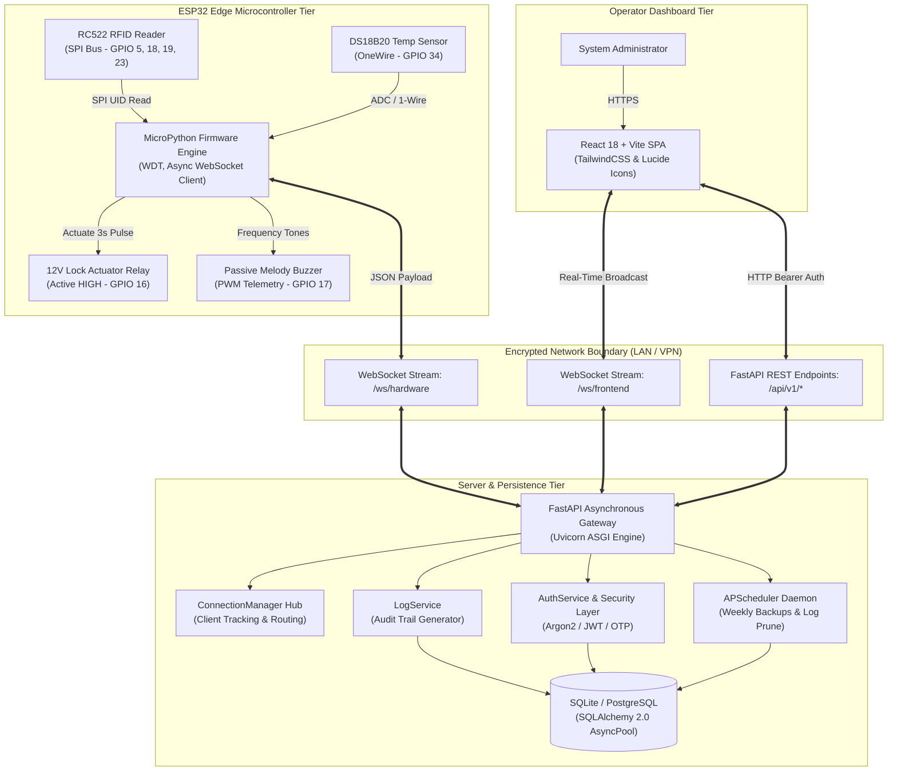
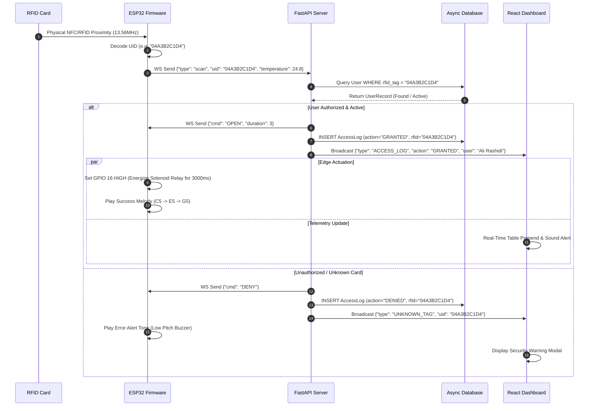

<div align="center">


# SentryGate

### Edge Access Control & Environmental Telemetry System with ESP32 and FastAPI

[](https://github.com/Ali-Rashidi-80/Simple-access-control/actions/workflows/ci.yml)
[](https://www.python.org/)
[](https://fastapi.tiangolo.com)
[](https://micropython.org/)
[](https://github.com/astral-sh/ruff)
[](http://mypy-lang.org/)
[](LICENSE)

**[English](README.md)** • **[فارسی](README.fa.md)** • **[Documentation](docs/)** • **[Report Bug](https://github.com/Ali-Rashidi-80/Simple-access-control/issues)**

</div>

---

## 📌 System Overview

**SentryGate** is an edge access control and environmental telemetry system. It connects **ESP32** microcontrollers running MicroPython with an asynchronous **FastAPI** backend and a **React** web dashboard over bi-directional **WebSockets**.

The system combines physical RFID badge scanning (Mifare RC522) with ambient temperature monitoring (DS18B20), multi-factor authentication (RFID, SMS OTP, Google OAuth2), automated weekly SQLite backups, and circuit protection (hardware Watchdog Timer, reverse flyback diode, and reconnection handling).

---

## 📑 Table of Contents

- [Key Features & Capabilities](#-key-features--capabilities)
- [System Architecture & Data Flow](#-system-architecture--data-flow)
- [Hardware Engineering & Wiring](#-hardware-engineering--wiring)
- [Protocol Specifications](#-protocol-specifications)
- [Repository Structure](#-repository-structure)
- [Quick Start Guide](#-quick-start-guide)
  - [Dockerized Deployment (Recommended)](#1-dockerized-deployment-recommended)
  - [Bare-Metal Local Development](#2-bare-metal-local-development)
  - [ESP32 Firmware Flashing](#3-esp32-firmware-flashing)
- [Security & Resilience Posture](#-security--resilience-posture)
- [Verification & Quality Gates](#-verification--quality-gates)
- [Documentation Index](#-documentation-index)
- [Contributing & License](#-contributing--license)

---

## 🚀 Key Features & Capabilities

| Capability | Engineering Implementation | Practical Advantage |
| :--- | :--- | :--- |
| **Hardware Resilience** | MicroPython with 15-second Hardware Watchdog (`WDT`) | Automatic crash recovery in < 2 seconds if network loops stall |
| **Real-Time Duplex Comms** | Dedicated WebSocket hubs (`/ws/hardware` & `/ws/frontend`) | Sub-15ms badge scan decision latency; eliminates HTTP polling |
| **Environmental Telemetry** | DS18B20 1-Wire digital bus with CRC verification | Early detection of hardware enclosure overheating |
| **SQL Safety** | Asynchronous SQLAlchemy 2.0 ORM with parameter binding | Parameterized queries prevent SQL injection vulnerabilities |
| **Identity Management** | Argon2/bcrypt hashing, signed JWTs, SMS OTP, OAuth2 | Granular RBAC, audit trails, and multi-factor operator authentication |
| **Automated Housekeeping** | Embedded APScheduler background cron tasks | Weekly hot database snapshots and automatic pruning of aged access logs |

---

## 🏗️ System Architecture & Data Flow

SentryGate decouples hardware signal acquisition, state evaluation, and administrative orchestration into three isolated tiers:



### Event Sequence: Physical Badge Scan to Door Actuation



---

## 🔌 Hardware Engineering & Wiring

### Bill of Materials (BOM)

| Component | Specification | Quantity | Purpose |
| :--- | :--- | :---: | :--- |
| **ESP32 NodeMCU** | ESP-WROOM-32 (Dual Core 240MHz, 4MB Flash, Wi-Fi 802.11 b/g/n) | 1 | Master Edge Controller |
| **RC522 RFID Module** | 13.56 MHz RFID/NFC Reader (Mifare Classic 1K Compatible) | 1 | Contactless Badge Acquisition |
| **Relay Module** | 1-Channel 5V/3.3V Optocoupler Isolated Relay | 1 | 12V Electric Strike / Solenoid Control |
| **Passive Buzzer** | 3.3V/5V Piezoelectric Transducer | 1 | Audio Telemetry & Feedback Chimes |
| **DS18B20 / LM35** | High-precision temperature sensor | 1 | Edge Enclosure Thermal Monitoring |
| **Flyback Diode** | 1N4007 (1000V 1A) | 1 | Solenoid Back-EMF Spark Suppression |
| **Power Supply** | 12V DC 2A Regulated Power Supply + Step-Down Buck Converter (5V) | 1 | Independent Power Rail Isolation |

### Pinout Configuration Matrix

```
                      +-------------------+
                      |   ESP32 DevKit    |
                      |                   |
      RC522 SDA/SS <--| GPIO 05   GPIO 16 |---> Relay Control (IN)
      RC522 SCK    <--| GPIO 18   GPIO 17 |---> Passive Buzzer (PWM)
      RC522 MISO   <--| GPIO 19   GPIO 04 |---> RC522 RST
      RC522 MOSI   <--| GPIO 23   GPIO 34 |---> Temp Sensor (Analog/1-Wire)
      Common Ground<--| GND       3V3     |---> RC522 VCC (3.3V ONLY!)
                      +-------------------+
```

> [!CAUTION]
> **Over-Voltage Warning:** The RC522 module **MUST** be powered from **3.3V**. Connecting VCC to the 5V rail will permanently destroy the MFRC522 silicon.
> 
> **Inductive Kickback Mitigation:** Always install a **1N4007 diode in reverse-bias parallel** across the 12V lock terminals. Collapsing magnetic fields from solenoids generate negative voltage spikes exceeding 200V, causing catastrophic ESP32 brownouts or flash memory corruption.

---

## 📡 Protocol Specifications

### 1. WebSocket Messages: Hardware to Server (`/ws/hardware`)

```json
// Badge Scan Event
{
  "type": "scan",
  "uid": "04A3B2C1D4",
  "temperature": 26.4,
  "is_duress": false
}

// Environmental Telemetry Broadcast
{
  "type": "telemetry",
  "temperature": 27.1,
  "humidity": 45.0
}

// Liveness Heartbeat
{
  "type": "ping"
}
```

### 2. WebSocket Commands: Server to Hardware

```json
// Grant Access & Pulse Relay
{
  "cmd": "OPEN",
  "duration": 3
}

// Deny Access
{
  "cmd": "DENY",
  "duration": 0
}

// Heartbeat Acknowledgment
{
  "cmd": "PONG"
}
```

### 3. REST API Key Endpoints

| Method | Endpoint | Authorization | Description |
| :--- | :--- | :--- | :--- |
| `POST` | `/auth/login` | Public | Authenticates admin using username/password; returns JWT bearer token |
| `POST` | `/auth/otp/send` | Public | Generates and dispatches 6-digit OTP via MeliPayamak SMS gateway |
| `POST` | `/auth/otp/verify` | Public | Verifies SMS OTP and generates authenticated user session |
| `GET` | `/users/` | Bearer Token | Retrieves paginated user list with role assignments and RFID tags |
| `POST` | `/users/` | Bearer Token | Provisions a new user profile bound to a physical RFID UID |
| `GET` | `/logs/` | Bearer Token | Queries historical access logs with date range and status filters |
| `GET` | `/settings/` | Bearer Token | Retrieves edge controller settings and backup configurations |

---

## 📂 Repository Structure

```
Access-Control-System/
├── .github/
│   └── workflows/
│       └── ci.yml               # GitHub Actions CI Quality Gate (Matrix: 3.11, 3.12)
├── backend/
│   ├── app/
│   │   ├── routers/             # FastAPI APIRouters (users, logs)
│   │   ├── services/            # Core business logic (processor, security, sms_otp)
│   │   ├── database.py          # Asynchronous SQLAlchemy engine & sessionmaker
│   │   ├── models.py            # Declarative ORM models (User, AccessLog, Setting)
│   │   ├── schemas.py           # Pydantic v2 validation contracts
│   │   └── main.py              # Application entrypoint & WebSocket connection hub
│   ├── tests/                   # 112-test automated verification suite
│   │   ├── conftest.py          # Pytest fixtures & async database engine
│   │   ├── test_api.py          # REST endpoint verification
│   │   ├── test_database.py     # ORM transaction & isolation tests
│   │   ├── test_esp32_simulation.py # Mock hardware protocol tests
│   │   ├── test_integration.py  # End-to-end user journeys
│   │   ├── test_otp.py          # SMS OTP challenge/verification tests
│   │   ├── test_security.py     # Auth, password hashing, and token tests
│   │   └── test_websocket.py    # Dual WebSocket concurrency & latency tests
│   ├── Dockerfile               # Production container image
│   └── requirements.txt         # Pinned backend dependencies
├── frontend/                    # React 18 + Vite dashboard interface
├── micro-python-esp32/
│   ├── boot.py                  # ESP32 network initialization & bootloader
│   ├── main.py                  # Main edge loop (RC522 reader, WDT, WebSocket client)
│   ├── mfrc522.py               # Optimized MicroPython MFRC522 SPI driver
│   ├── config.example.json      # Template for WiFi SSID & backend URL
│   └── test/                    # Edge test scripts
├── docs/
│   ├── assets/                  # High-resolution 3D logos and banner assets
│   ├── ARCHITECTURE.md          # In-depth system architectural specification
│   ├── HARDWARE_GUIDE.md        # Assembly, soldering, and schematic blueprints
│   └── CONTRIBUTING.md          # Code standards, formatting, and PR rules
├── docker-compose.yml           # Multi-container orchestration (App, DB, Nginx)
├── pyproject.toml               # Unified tool config (ruff, black, isort, mypy, pytest)
├── .env.example                 # Sanitized environment configuration template
├── LICENSE                      # Standard MIT License
├── SECURITY.md                  # Vulnerability disclosure policy
└── README.md                    # Canonical project documentation (English)
```

---

## ⚡ Quick Start Guide

### 1. Dockerized Deployment (Recommended)

Clone the repository and deploy the full stack using Docker Compose:

```bash
# 1. Clone repository
git clone https://github.com/Ali-Rashidi-80/Access-Control-System.git
cd Access-Control-System

# 2. Configure environment
cp .env.example .env
# Edit .env with your custom SECRET_KEY and credentials

# 3. Launch isolated services
docker compose up -d --build

# 4. Verify service health
docker compose ps
```

The services will be exposed at:
- **Web Dashboard:** `http://localhost:3000` (or `http://localhost:80`)
- **FastAPI OpenAPI Docs:** `http://localhost:8000/docs`
- **Hardware WebSocket Endpoint:** `ws://localhost:8000/ws/hardware`

---

### 2. Bare-Metal Local Development

#### Backend Setup
```bash
cd backend

# Create virtual environment
python -m venv .venv
source .venv/bin/activate  # Windows: .venv\Scripts\activate

# Install dependencies
pip install -r requirements.txt

# Initialize database and default admin (admin / admin123)
python init_db.py

# Launch development server
uvicorn app.main:app --reload --host 0.0.0.0 --port 8000
```

#### Frontend Setup
```bash
cd frontend

# Install packages
npm install

# Start Vite hot-reloading dev server
npm run dev
```

---

### 3. ESP32 Firmware Flashing

1. Flash official MicroPython firmware (ESP32 Generic) to your microcontroller via `esptool.py`.
2. Connect your ESP32 to USB and copy firmware files:
   ```bash
   cd micro-python-esp32
   cp config.example.json config.json
   # Configure your WiFi credentials and Server IP in config.json
   
   # Using ampy or mpremote:
   mpremote cp config.json :config.json
   mpremote cp mfrc522.py :mfrc522.py
   mpremote cp boot.py :boot.py
   mpremote cp main.py :main.py
   mpremote reset
   ```
3. Open serial monitor (`mpremote repl` or baud rate `115200`) to confirm successful WiFi association and WebSocket handshake.

---

## 🛡️ Security & Resilience Posture

- **Defensive Data Handling:** Strict schema enforcement via Pydantic v2 rejects any ill-formed or unexpected hardware JSON payload before reaching the database layer.
- **Fail-Secure Circuit Topology:** Relays are wired in a **Normally Open (NO)** configuration; in the event of complete power loss or microcontroller freeze, entry points remain securely locked.
- **Brownout & Stagnation Immunity:** Firmware watchdog timer resets the processor automatically if network sockets stall for more than 15 seconds.
- **Air-Gapped Logging:** Historical audit logs contain user ID, RFID hash, exact UTC timestamp, and thermal sensor readings, preventing repudiation.
- **Secrets Sanitization:** Version control tracking excludes all `.env` files, compiled bytecode, test databases, and hardware credentials.

---

## 🧪 Verification & Quality Gates

SentryGate enforces strict deterministic code quality:

```bash
# 1. Syntax Compilation Check
python -m compileall backend

# 2. Fast Linter (Ruff)
python -m ruff check backend

# 3. Formatting Verification (Black & isort)
python -m black backend --check
python -m isort backend --check-only

# 4. Strict Static Type Checking (Mypy)
python -m mypy backend/app

# 5. Pylint Static Code Integrity
python -m pylint backend/app --errors-only

# 6. Complete Automated Test Suite (112 tests)
python -m pytest backend/tests -v
```

---

## 📚 Documentation Index

- [Architecture & Sequence Workflows](docs/ARCHITECTURE.md)
- [Hardware Wiring & Soldering Blueprint](docs/HARDWARE_GUIDE.md)
- [Testing Suite Protocol](TESTING.md)
- [Security Disclosure Policy](SECURITY.md)
- [Contributing Guidelines](docs/CONTRIBUTING.md)
- [Version Changelog](CHANGELOG.md)

---

## 👥 Author

- [Ali Rashidi](https://github.com/Ali-Rashidi-80)

---

## 📄 License

This project is licensed under the terms of the [MIT License](LICENSE).
© 2026 Ali Rashidi. All rights reserved.
