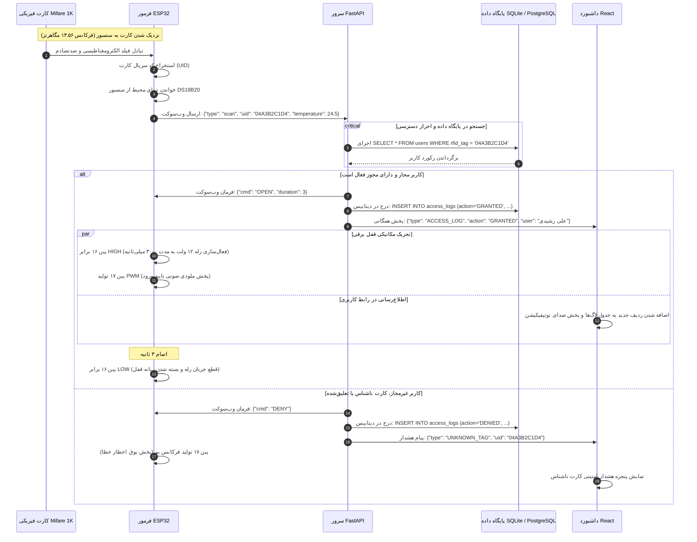
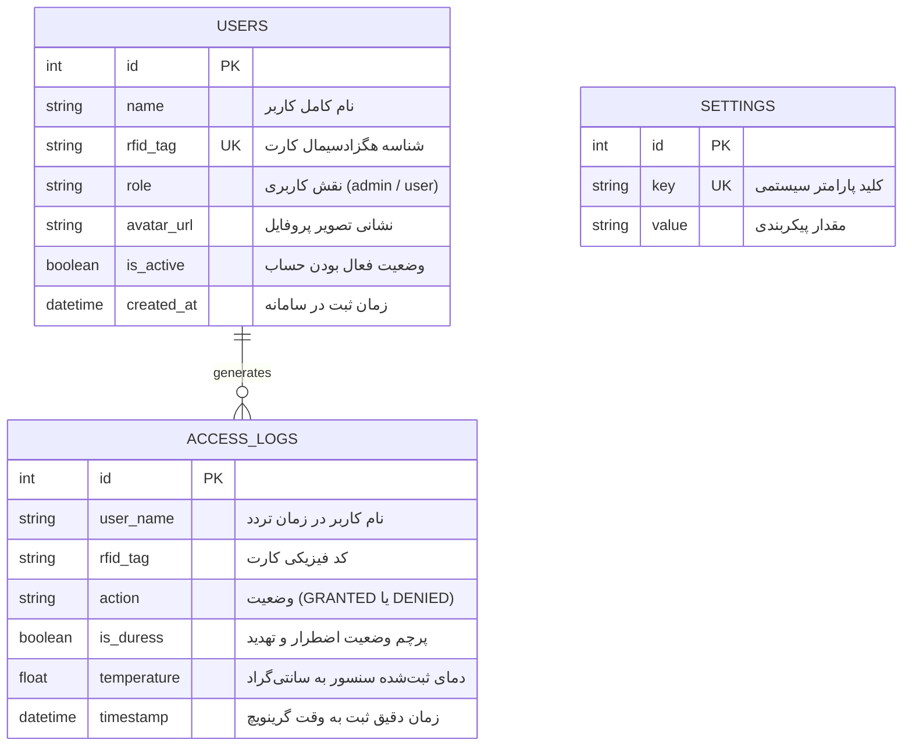

<div dir="rtl">

# 🏗️ مشخصات معماری سیستم کنترل تردد (SentryGate)

**[English](ARCHITECTURE.md)** • **[فارسی](ARCHITECTURE.fa.md)**

این سند مشخصات فنی و معماری سیستم کنترل تردد و تله‌متری محیطی <bdi>**SentryGate**</bdi> است.

---

## ۱. تفکیک لایه‌های معماری سیستم

معماری سامانه به سه لایه کاملاً مجزا و هماهنگ‌شده به صورت ناهمگام (<bdi>Asynchronous</bdi>) تفکیک شده است:

```
[ لایه سخت‌افزار لبه ] <--- شبکه رمزنگاری‌شده LAN / وب‌سوکت ---> [ لایه سرور مرکزی ] <--- وب‌سوکت / REST ---> [ لایه رابط اپراتوری ]
(ESP32 + RC522 + رله)                                     (FastAPI + دیتابیس)                             (داشبورد React 18)
```

### ۱.۱ لایه سخت‌افزار لبه (<bdi>ESP32 & MicroPython</bdi>)
- **نقش:** کنترلر مستقل محیطی، دریافت سیگنال کارت‌های بدون تماس <bdi>RFID</bdi>، زمان‌بندی دقیق رله قفل و پایش دمای محیط.
- **پلتفرم پردازنده:** تراشه <bdi>Espressif ESP32-WROOM-32</bdi> (دو هسته ۳۲ بیتی با فرکانس ۲۴۰ مگاهرتز).
- **درایورهای لبه:** فریمور سفارشی میکروپایتون مجهز به درایور گذرگاه <bdi>SPI</bdi> ماژول <bdi>RC522</bdi>، تایمر سگ نگهبان سخت‌افزاری (<bdi>**Hardware WDT**</bdi>) و کلاینت ناهمگام وب‌سوکت.
- **سازوکار وضعیت ایمن (<bdi>Fail-Secure</bdi>):** در صورت قطع شبکه یا در دسترس نبودن سرور، مدار در حالت امن قفل فیزیکی باقی مانده و رویدادها را ثبت می‌کند.

### ۱.۲ لایه سرور مرکزی (<bdi>FastAPI & SQLAlchemy 2.0</bdi>)
- **نقش:** پردازشگر مرکزی تراکنش‌ها، صدور توکن‌های احراز هویت، اعتبارسنجی قوانین کنترل دسترسی و بازپخش داده‌های تله‌متری.
- **فریمورک:** پلتفرم <bdi>**FastAPI**</bdi> تحت وب‌سرور <bdi>Uvicorn ASGI</bdi> با بهره‌گیری کامل از حلقه رویدادهای ناهمگام پایتون 3.11 و 3.12.
- **هاب اتصالات:** کلاس <bdi>`ConnectionManager`</bdi> با نگهداری جداول مجزا برای سوکت‌های سخت‌افزار (<bdi>`/ws/hardware`</bdi>) و داشبوردها (<bdi>`/ws/frontend`</bdi>).
- **موتور پایگاه داده:** نگاشت رابطه‌ای <bdi>SQLAlchemy 2.0</bdi> به همراه استخر اتصالات ناهمگام (<bdi>AsyncPool</bdi>) و کوئری‌های مقیدسازی‌شده.
- **زمان‌بندی تسک‌ها:** سرویس زمان‌بند درون‌برنامه‌ای <bdi>**APScheduler**</bdi> برای پشتیبان‌گیری خودکار هفتگی و پاکسازی لاگ‌های منقضی.

### ۱.۳ لایه نمایش و داشبورد (<bdi>React 18 & Vite</bdi>)
- **نقش:** کنسول مانیتورینگ اپراتور، نمایش لحظه‌ای لاگ تردد، نمودار تله‌متری حرارتی، ثبت کاربران جدید و باز کردن اضطراری درب از راه دور.
- **پشته فنی:** کتابخانه <bdi>React 18</bdi>، ابزار ساخت <bdi>Vite</bdi>، استایل‌دهی <bdi>TailwindCSS</bdi> و کلاینت وب‌سوکت با بازاتصال هوشمند.

---

## ۲. مشخصات پروتکل ارتباط بلادرنگ

تمامی ارتباطات سخت‌افزار با سرور بر بستر وب‌سوکت دوطرفه و با بسته‌های اعتبارسنجی‌شده توسط اسکیمای <bdi>**Pydantic v2**</bdi> صورت می‌پذیرد.

### ۲.۱ نمودار توالی جامع فرآیند تردد و فرمان رله



---

## ۳. مدل داده و ساختار جداول پایگاه داده

طراحی پایگاه داده به صورت بهینه و مینیمال با هدف حداکثر سرعت در ایندکس‌ها و کوئری‌های همزمان انجام گرفته است:



---

## ۴. ایمنی مدار سخت‌افزار و پایداری لبه

۱. **تایمر نگهبان سخت‌افزاری (<bdi>WDT</bdi>):**
   یک تایمر مستقل ۱۵ ثانیه‌ای در پردازنده فعال است. حلقه اصلی برنامه باید در هر چرخه تایمر را شارژ کند؛ در صورت بروز هرگونه بن‌بست شبکه، پردازنده بی‌درنگ ریست سخت‌افزاری شده و مدار در کمتر از ۲ ثانیه مجدداً فعال می‌شود.

۲. **حذف اسپایک ولتاژ بوبین (<bdi>Flyback Diode</bdi>):**
   قفل برقی ۱۲ ولت خاصیت سلفی دارد. قطع جریان آن تولید ولتاژ معکوس شدیدی می‌کند. دیود هرزگرد <bdi>1N4007</bdi> موازی در دو سر بوبین، این انرژی را دمپ کرده و از آسیب به رله یا ریست پردازنده جلوگیری می‌نماید.

۳. **ایزولاسیون تغذیه رله:**
   خط تغذیه ۱۲ ولت قفل از خط ولتاژ میکروکنترلر با استفاده از اپتوکوپلر روی ماژول رله به طور کامل ایزوله است.

---

## ۵. مدل امنیت و احراز هویت

- **جامعیت داده‌ها:** کلیه تبادلات شبکه تحت احراز هویت توکن‌های امضاشده <bdi>JWT</bdi> صورت می‌پذیرد. گذرواژه‌ها با الگوریتم مدرن <bdi>Argon2/bcrypt</bdi> هش می‌شوند.
- **تایید دومرحله‌ای پیامکی (<bdi>SMS OTP</bdi>):** برای تغییرات حساس و ورود مدیران، کدهای ۶ رقمی یکبارمصرف از طریق وب‌سرویس ملی‌پیامک ارسال و اعتبارسنجی می‌شوند.
- **حفاظت کوئری‌ها:** کلیه دسترسی‌ها به پایگاه داده از طریق نگاشت <bdi>SQLAlchemy</bdi> انجام شده و امکان حملات <bdi>SQL Injection</bdi> ناممکن است.

</div>
