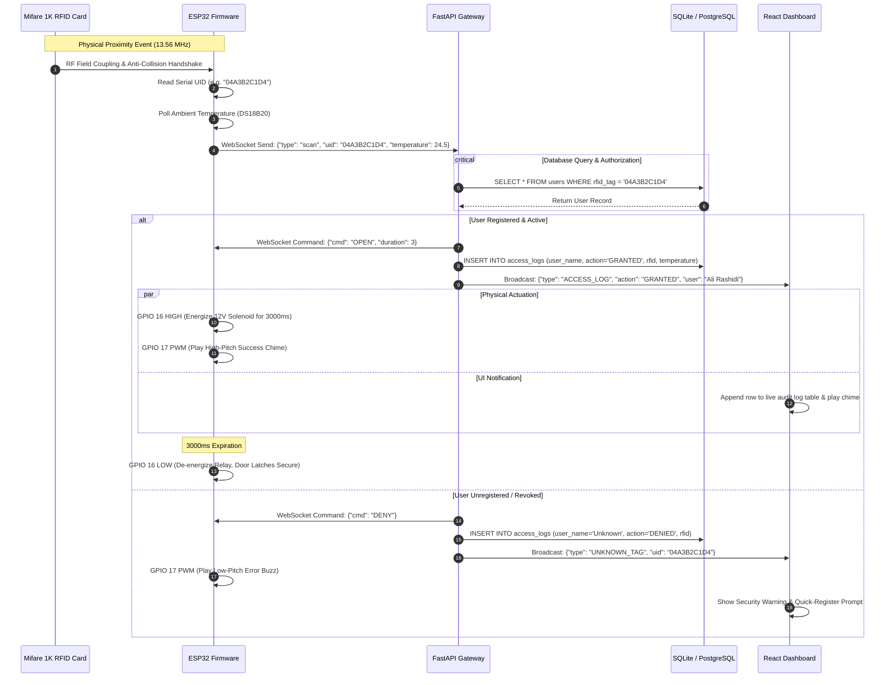
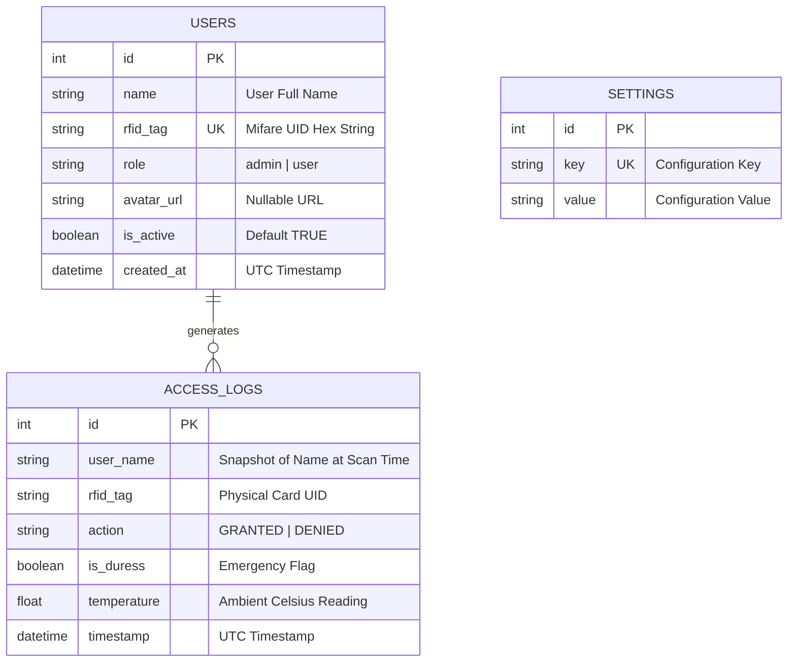

# 🏗️ SentryGate System Architecture Specification

**[English](ARCHITECTURE.md)** • **[فارسی](ARCHITECTURE.fa.md)**

This document provides the canonical architectural and engineering blueprint of the **SentryGate** access control and environmental telemetry ecosystem.

---

## 1. System Decomposition & Tiering

The architecture is divided into three physically decoupled and asynchronously coordinated layers:

```
[ Edge Hardware Tier ] <--- Encrypted LAN / WebSocket ---> [ Central Server Tier ] <--- WebSocket / REST ---> [ Presentation Tier ]
(ESP32 + RC522 + Relay)                                  (FastAPI + SQLite / Postgres)                       (React 18 Dashboard)
```

### 1.1 Edge Hardware Tier (ESP32 & MicroPython)
- **Role:** Autonomous edge controller, contactless RFID signal acquisition, local actuator timing, and thermal telemetry collection.
- **Hardware Platform:** Espressif ESP32-WROOM-32 (Tensilica Xtensa Dual-Core 32-bit LX6, 240MHz).
- **Core Drivers:** MicroPython runtime with customized MFRC522 SPI bus driver, hardware Watchdog Timer (`WDT`), and non-blocking asynchronous WebSocket client.
- **Fail-Safe Mechanism:** In the event of network partition or server unreachability, the edge controller logs failures locally and enforces fail-secure state (relay de-energized).

### 1.2 Central Server Tier (FastAPI & SQLAlchemy 2.0)
- **Role:** Central transaction processor, cryptographic token issuer, role-based access evaluator, and telemetry broadcast hub.
- **Framework:** FastAPI running on Uvicorn ASGI server with full Python 3.11/3.12 async event loops.
- **Connection Hub:** `ConnectionManager` maintains isolated client registries for `/ws/hardware` (edge controllers) and `/ws/frontend` (management dashboards).
- **Persistence Engine:** SQLAlchemy 2.0 asynchronous ORM with connection pooling, declarative models, and parameterized SQL generation.
- **Task Automation:** Embedded `APScheduler` cron scheduler handling weekly SQLite hot backups and aged access log compaction.

### 1.3 Presentation Tier (React 18 & Vite)
- **Role:** Operator interface, real-time live access log streamer, telemetry monitor, user badge management, and remote emergency door release.
- **Technology Stack:** React 18, Vite, TailwindCSS, Lucide-React, and native WebSocket listener with automatic exponential-backoff reconnection.

---

## 2. Real-Time Communication Protocol

All communication between edge nodes and the server occurs over bi-directional WebSocket channels using typed JSON envelopes validated by Pydantic v2 schemas.

### 2.1 Complete Sequence Diagram: Access Verification & Actuation



---

## 3. Database Schema & Data Models

The persistence schema is deliberately lean and optimized for indexing speed and rapid point lookups:



---

## 4. Hardware Safety & Resilience Topology

1. **Hardware Watchdog (`WDT`):**
   A dedicated 15-second hardware watchdog timer runs on the ESP32 CPU. The main polling loop must feed the watchdog on every cycle; if network transmission or thread deadlocks occur, the hardware triggers a hard reset, restoring operational state in under 2 seconds.

2. **Inductive Kickback Protection:**
   The 12V electromagnetic lock constitutes an inductive load. An antiparallel 1N4007 flyback diode across the lock terminals absorbs collapsing magnetic field flyback voltages, preventing spikes from resetting the ESP32.

3. **Isolated Power Rails:**
   The 12V lock rail is physically decoupled from the 3.3V/5V microcontroller rail via an optocoupler on the relay module.

---

## 5. Security & Authentication Model

- **Data Integrity:** All HTTP traffic is protected by JWT bearer tokens signed with a 256-bit secret. Passwords utilize Argon2/bcrypt adaptive hashing.
- **SMS Two-Factor Authentication:** High-privilege access challenges trigger 6-digit cryptographic OTPs via the MeliPayamak SMS Gateway.
- **Parameterization:** All database operations utilize SQLAlchemy 2.0 compiled statements, precluding SQL injection vulnerabilities.
